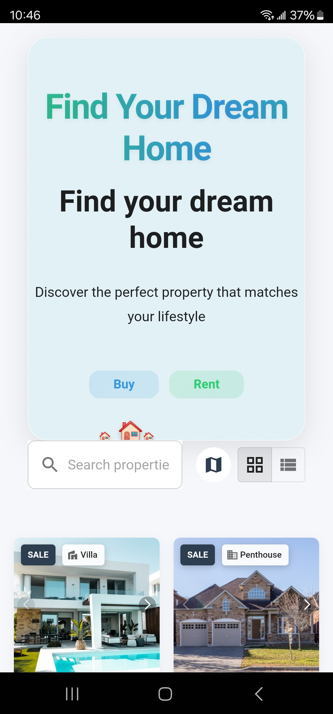
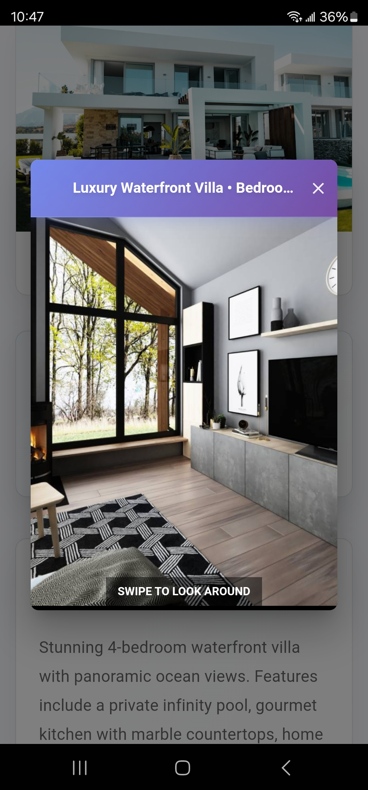

# 📸 Project Visuals

## 🖥️ Mobile App Screenshots

### Home Screen

### 3D Tour

### Property Details

## 🎥 Demo Video

[📹 View App Walkthrough Video](demo-videos/app_walkthrough.mp4)

## 📱 Device Compatibility
- Android 10+
- iOS 13+

## 🌈 UI/UX Features
- Responsive Design
- Dark/Light Mode Support
- Smooth Navigation
- High-Performance Rendering

## 🔍 Performance Metrics
- Average Load Time: < 2s
- Memory Usage: Optimized
- Battery Efficient

**Note**: Screenshots and videos are representative of the latest stable release.
