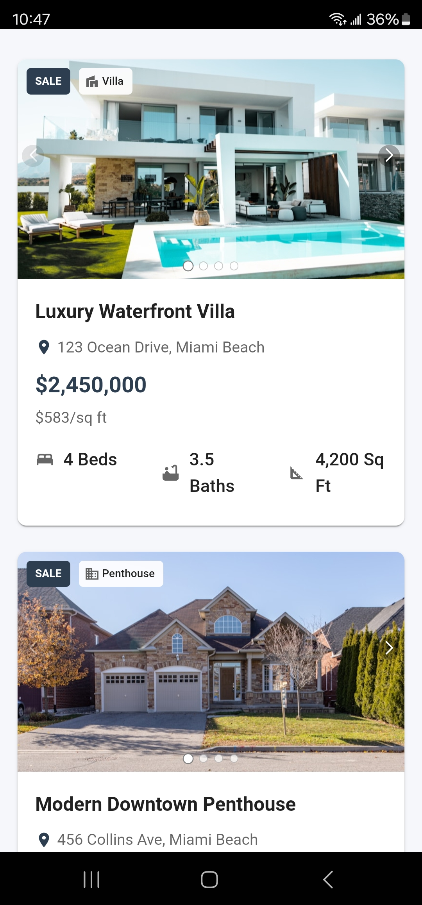
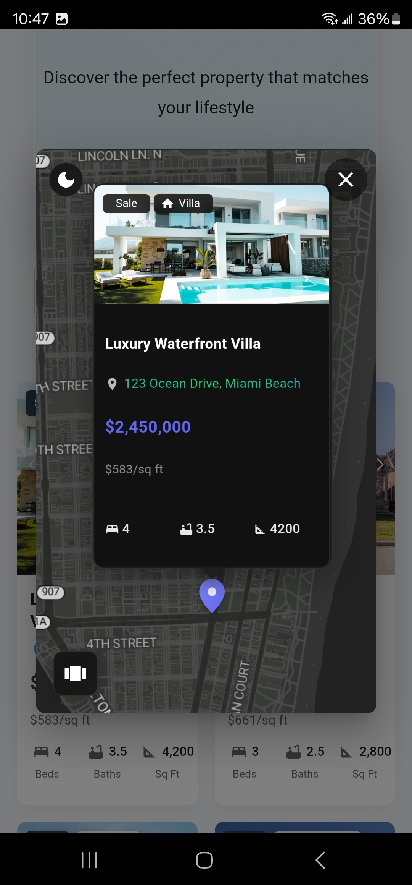

# 📸 Project Visuals

## 🖥️ Mobile App Screenshots

### Home Screen

### 3D Tour

### List View

### Map View

## 🎥 Demo Video

[📹 View App Walkthrough Video](demo-videos/app_walkthrough.mp4)

## 📱 Device Compatibility
- Android 14+ (Tested and Optimized)
- Android 10-13 (Limited Support)

## 🌈 UI/UX Features
- Responsive Design
- Smooth Navigation
- High-Performance Rendering

## 🚀 Performance
- Optimized for Mobile Devices
- Efficient Resource Management

**Note**: Screenshots and videos are representative of the latest stable release.
